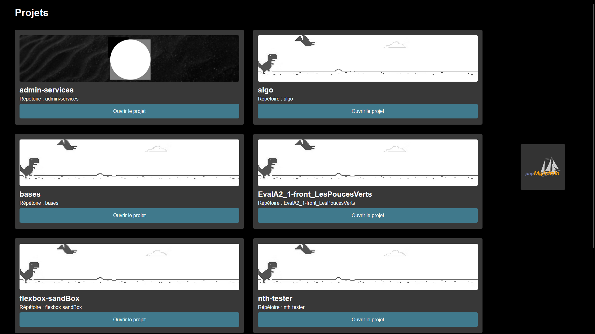

# XAMPP Index

## Introduction
**XAMPP Index** est un simple fichier PHP qui remplace la page d'accueil de base de **LAMP** (Linux), **MAMP** (macOS), **WAMP** (Windows) et **XAMPP** (sur les trois).\
Une fois installé, **XAMPP Index** va récupérer l'ensemble des projets présents dans `htdocs`.
## Installation
### Avant de commencer
> Sauvegardez toujours les fichiers installés par défaut avec votre émulateur de serveur !

Téléchargez la dernière version depuis les [releases](https://github.com/enioaiello/xampp-index/releases/latest).
### WAMP
Déplacez `index.php` dans la racine de `C:\wamp\www`. Si un remplacement est demandé, procédez.\
Ou vous pouvez effectuer cette commande (dans un **CMD** en administrateur) :
```
xcopy %USERPROFILE%\Downloads\index.php C:\wamp\www /-y
```
> Remplacez le `%USERPROFILE%\Downloads\index.php` par le fichier que vous venez de télécharger si celui-ci est introuvable.

### MAMP
Déplacez `index.php` dans `/Applications/MAMP/htdocs`. Si un remplacement est demandé, procédez.
### LAMP
Déplacez `index.php` dans la racine de `/opt/lampp/htdocs/`. Si un remplacement est demandé, procédez.
### XAMPP
#### Windows
Déplacez `index.php` dans la racine de `C:\xampp\htdocs`. Si un remplacement est demandé, procédez.
```
xcopy %USERPROFILE%\Downloads\index.php C:\xampp\htdocs /-y
```
#### macOS
Montez le volume `/opt/lampp` via `Disk Utility.app`, `Terminal.app` ou via les préférences XAMPP.\
Accédez au disque virtuel monté et accédez à `htdocs` puis copiez `index.php` à la racine. Si un remplacement est demandé, procédez.\
N'oubliez pas de démonter le volume virtuel avant de procéder.
#### Linux
Déplacez `index.php` dans la racine de `/opt/lampp/htdocs/`. Si un remplacement est demandé, procédez.
## Utilisation
Démarrez le serveur Apache (et MySQL si nécessaire), et accédez à la racine de `localhost`.\
Pour utiliser l'icône **PhpMyAdmin** (base de données) **MySQL** doit être actif.
### Bannières
Pour définir une bannière dans un projet, glissez la bannière ayant pour nom et extension `banner.png` dans le répertoire `[RACINE]\assets\img`.
## Statistiques


